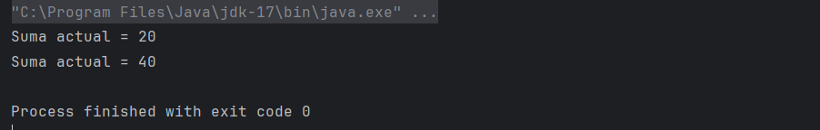
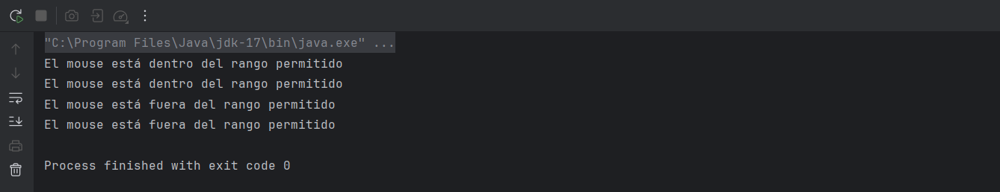

# Taller Individual  2
## Programación funcional reactiva

**Semana**: 10

**Objetivos**:

- Aplicar los conocimientos sobre programación funcional reactiva.

### Descripción:

Resuelva los siguientes problemas.

### Problema 1: Promedio de números

Crear un programa usando Rx que trabaje con una lista de números enteros (calificaciones) que cuando se actualiza se calcula automáticamente la suma de sus elementos y se almacena en la variable suma.

**Entrada esperada**
```yaml
calificaciones() = calificaciones.now :+ 10 // Agrega una calificación
calificaciones() = calificaciones.now :+ 20 // Agrega otra calificación
```

**Salida esperada**
```yaml
Suma actual = 20
Suma actual = 40
```

> Adjuntar capturas de ejecución

### Problema 2: Seguimiento de coordenadas del mouse
Crea un programa que permita rastrear la posición del mouse en tiempo real y realice las siguientes acciones:

- Utiliza dos variables reactivas (Var), mouseX y mouseY, para almacenar las coordenadas X e Y actuales del mouse.
- Cada vez que cambie la posición del mouse:
  - Calcula automáticamente la distancia del cursor al origen (0, 0) usando la fórmula de distancia euclidiana. Almacena este cálculo en una variable reactiva (definición reactiva) llamada distancia.
  - Si la distancia al origen supera un umbral dado (por ejemplo, 200 unidades), imprime un mensaje indicando que el mouse está "Fuera del rango permitido".

> Adjuntar capturas de ejecución

### Resultado:
### Problema 1:
```Scala
package Bim2.Semana10
import rx._

object PromedioNumeros extends App {
  // Declaración de la lista de calificaciones como una variable reactiva
  val calificaciones = Var(List(10))

  // Cálculo reactivo de la suma
  val suma = Rx { calificaciones().sum }

  // Imprimir la suma después de cada actualización
  calificaciones.triggerLater {
    println("Suma actual = " + suma.now)
  }

  // Agregar elementos a la lista de calificaciones
  calificaciones() = calificaciones.now :+ 10 // Primera calificación
  calificaciones() = calificaciones.now :+ 20 // Segunda calificación
}
```
- Imagen:
  



### Problema 2:
```Scala
package Bim2.Semana10

import rx._
import scala.math.sqrt

object CoordenadasMouse extends App {
  // Variables reactivas para las coordenadas del mouse
  val mouseX = Var(0)  // Coordenada X
  val mouseY = Var(0)  // Coordenada Y

  // Variable reactiva para calcular la distancia al origen (0, 0)
  val distancia = Rx {
    sqrt(mouseX() * mouseX() + mouseY() * mouseY())
  }

  // Umbral de distancia
  val umbral = 200.0

  // Observador que se ejecuta cada vez que cambia la distancia
  distancia.triggerLater {
    if (distancia.now > umbral) {
      println("El mouse está fuera del rango permitido")
    } else {
      println("El mouse está dentro del rango permitido")
    }
  }

  // Simulando actualizaciones de las coordenadas del mouse
  mouseX() = 100  // Coordenada X
  mouseY() = 150  // Coordenada Y

  mouseX() = 220  // Cambio en X, debería detectar que está fuera del rango
  mouseY() = 180  // Cambio en Y
}
```
- Imagen:
  


### Calificación:

Una vez que termine debe presentar su trabajo a su docente.

- 10 puntos si presenta en el horario de prácticas y experimentación.
- 7 puntos presenta en el horario de tutoría

La hora máxima de presentación será las 8h30
