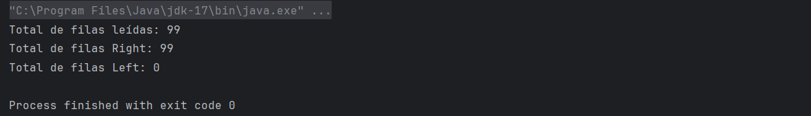
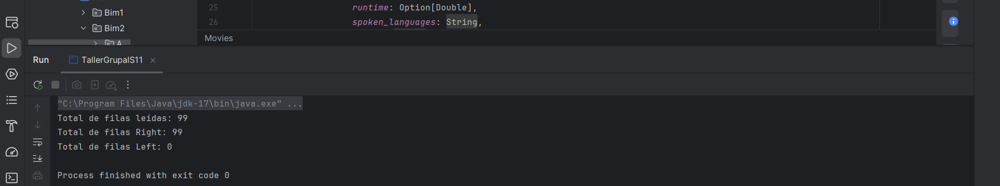
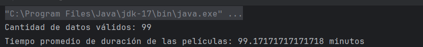
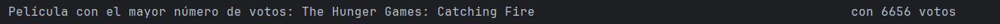
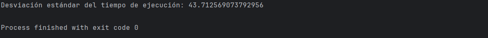

# Taller Grupal  1
## Programación funcional reactiva

**Semana**: 11

**Objetivos**:

- Crear un case class en Scala para modelar datos de un archivo CSV (data set de proyecto integrador).
- Manipular datos como una lista de objetos y realizar operaciones estadísticas.
- Comprender la relación entre datos y aplicar fórmulas estadísticas a análisis exploratorios.

> [!IMPORTANT]
> Resolver el siguiente problema en grupos según proyecto integrador (**solo estudiantes presentes en el aula**)

***


### Parte 1: Definición de case class y lectura de archivo

- Utilizando la case clase que construyó, como tarea, lea los datos del dataset de movies y trate de responder a las siguientes preguntas:

  Asegúrese que los atributos `popularity`, `runtime`, `vote_average` son de tipo real.

  - ¿Cuántas filas pudo leer?
  - ¿Cuántos filas son `Right`?
  - ¿Cuántos filas son `Left`?

- Ahora modifique el case class para que el atributo runtime sea del tipo
`Option[Double]` y vuelva a responder las preguntas anteriores.


> Adjuntar código y capturas de ejecución

### Parte 2: Análisis de datos

- ¿Cuál es el tiempo promedio que duran las películas dentro del dataset? (use la propiedad `runtime`)
- Encuentra el objeto `Movie` con el mayor número de votos (`vote_count`)
- Calcula la desviación estándar del tiempo de ejecución (`runtime`) usando la fórmula:

  $$
  \sigma = \sqrt{\frac{\sum_{i=1}^{n} (x_i - \overline{x})^2}{n}}
  $$

  Donde $x_i$ es la calificación de cada película, $\overline{x}$ es el promedio de las calificaciones y $n$ es el número total de películas.

> Adjuntar los bloques de código y capturas de ejecución
### Resultados:
### Parte 1: Definición de case class y lectura de archivo
```Scala
package Bim2.Semana11

import kantan.csv._
import kantan.csv.ops._
import kantan.csv.generic._
import java.io.File

case class Movies(
                   adult: Boolean,
                   belongs_to_collection: String,
                   budget: Int,
                   genres: String,
                   homepage: String,
                   id: Int,
                   imdb_id: String,
                   original_language: String,
                   original_title: String,
                   overview: String,
                   popularity: Double,
                   poster_path: String,
                   production_companies: String,
                   production_countries: String,
                   release_date: String,
                   revenue: Long,
                   runtime: Double,
                   spoken_languages: String,
                   status: String,
                   tagline: String,
                   title: String,
                   video: Boolean,
                   vote_average: Double,
                   vote_count: Int,
                   keywords: String,
                   cast: String,
                   crew: String,
                   ratings: String
                 )

object TallerGrupalS11 extends App {
  val path2DataFile2 = "data/pi_movies_small.csv"

  // Configurar lectura del CSV con delimitador ';'
  val dataSource2 = new File(path2DataFile2)
    .readCsv[List, Movies](rfc.withHeader.withCellSeparator(';'))

  // Filtrar filas válidas
  val rows = dataSource2.collect { case Right(movie) => movie }
  // Filtrar filas inválidas
  val errores = dataSource2.collect { case Left(error) => error }

  // Calcular los totales
  val totalFilas = dataSource2.size
  val nro_datos_ok = rows.length
  val nro_datos_error = errores.length

  // Imprimir resultados
  println(s"Total de filas leídas: $totalFilas")
  println(s"Total de filas Right: $nro_datos_ok")
  println(s"Total de filas Left: $nro_datos_error")
}

```
**- Consola**



  - ¿Cuántas filas pudo leer?
  Se pueden leer 99 filas
  - ¿Cuántos filas son `Right`?
  Existen 99 filas de tipo Rigth
  - ¿Cuántos filas son `Left`?
  Existen 0 filas de tipo Left


- Ahora modifique el case class para que el atributo runtime sea del tipo
`Option[Double]` y vuelva a responder las preguntas anteriores.



  - ¿Cuántas filas pudo leer?
  Se pueden leer 99 filas
  - ¿Cuántos filas son `Right`?
  Existen 99 filas de tipo Rigth
  - ¿Cuántos filas son `Left`?
  Existen 0 filas de tipo Left


  R: Los valores no cambian.

### Parte 2: Análisis de datos

- ¿Cuál es el tiempo promedio que duran las películas dentro del dataset? (use la propiedad runtime)

```Scala
 package Bim2
  import kantan.csv._
  import kantan.csv.ops._
  import kantan.csv.generic._
  import java.io.File

  case class Movies(
                     adult: Boolean,
                     belongs_to_collection: String,
                     budget: Int,
                     genres: String,
                     homepage: String,
                     id: Int,
                     imdb_id: String,
                     original_language: String,
                     original_title: String,
                     overview: String,
                     popularity: Double,
                     poster_path: Option[String],
                     production_companies: String,
                     production_countries: String,
                     release_date: String,
                     revenue: Long,
                     runtime: Double,
                     spoken_languages: String,
                     status: String,
                     tagline: String,
                     title: String,
                     video: Boolean,
                     vote_average: Double,
                     vote_count: Int,
                     keywords: String,
                     cast: String,
                     crew: String,
                     ratings: String
                   )

  object AvancePracticum extends App {
    val path2DataFile2 = "data/pi_movies_small.csv"

    // Configurar lectura del CSV con delimitador ';'
    val dataSource2 = new File(path2DataFile2)
      .readCsv[List, Movies](rfc.withHeader.withCellSeparator(';'))

    // Filtrar filas válidas
    val rows = dataSource2.collect {
      case Right(movie) => movie
    }

    val nro_datos_ok = rows.length
    println(s"Cantidad de datos válidos: ${nro_datos_ok}")

    // 1. ¿Cuál es el tiempo promedio que duran las películas dentro del dataset? (usando la propiedad runtime)

    val sum_runtime = rows.map(_.runtime).sum
    val avg_runtime = sum_runtime / nro_datos_ok
    println(s"Tiempo promedio de duración de las películas: ${avg_runtime} minutos")
  }
```



- Encuentra el objeto Movie con el mayor número de votos (vote_count)

``` Scala
 package Bim2
  import kantan.csv._
  import kantan.csv.ops._
  import kantan.csv.generic._
  import java.io.File

  case class Movies(
                     adult: Boolean,
                     belongs_to_collection: String,
                     budget: Int,
                     genres: String,
                     homepage: String,
                     id: Int,
                     imdb_id: String,
                     original_language: String,
                     original_title: String,
                     overview: String,
                     popularity: Double,
                     poster_path: Option[String],
                     production_companies: String,
                     production_countries: String,
                     release_date: String,
                     revenue: Long,
                     runtime: Double,
                     spoken_languages: String,
                     status: String,
                     tagline: String,
                     title: String,
                     video: Boolean,
                     vote_average: Double,
                     vote_count: Int,
                     keywords: String,
                     cast: String,
                     crew: String,
                     ratings: String
                   )

  object AvancePracticum extends App {
    val path2DataFile2 = "data/pi_movies_small.csv"

    // Configurar lectura del CSV con delimitador ';'
    val dataSource2 = new File(path2DataFile2)
      .readCsv[List, Movies](rfc.withHeader.withCellSeparator(';'))

    // Filtrar filas válidas
    val rows = dataSource2.collect {
      case Right(movie) => movie
    }

    val nro_datos_ok = rows.length
    println(s"Cantidad de datos válidos: ${nro_datos_ok}")

    // 1. ¿Cuál es el tiempo promedio que duran las películas dentro del dataset? (usando la propiedad runtime)

    val sum_runtime = rows.map(_.runtime).sum
    val avg_runtime = sum_runtime / nro_datos_ok
    println(s"Tiempo promedio de duración de las películas: ${avg_runtime} minutos")

    // 2. Encuentra el objeto Movie con el mayor número de votos (vote_count)

    val movie_with_max_votes = rows.maxBy(_.vote_count)
    println(s"Película con el mayor número de votos: ${movie_with_max_votes.title} con ${movie_with_max_votes.vote_count} votos")
  }

```



- Calcula la desviación estándar del tiempo de ejecución (runtime):

``` Scala
package Bim2
import kantan.csv._
import kantan.csv.ops._
import kantan.csv.generic._
import java.io.File

case class Movies(
                   adult: Boolean,
                   belongs_to_collection: String,
                   budget: Int,
                   genres: String,
                   homepage: String,
                   id: Int,
                   imdb_id: String,
                   original_language: String,
                   original_title: String,
                   overview: String,
                   popularity: Double,
                   poster_path: Option[String],
                   production_companies: String,
                   production_countries: String,
                   release_date: String,
                   revenue: Long,
                   runtime: Double,
                   spoken_languages: String,
                   status: String,
                   tagline: String,
                   title: String,
                   video: Boolean,
                   vote_average: Double,
                   vote_count: Int,
                   keywords: String,
                   cast: String,
                   crew: String,
                   ratings: String
                 )

object AvancePracticum extends App {
  val path2DataFile2 = "data/pi_movies_small.csv"

  // Configurar lectura del CSV con delimitador ';'
  val dataSource2 = new File(path2DataFile2)
    .readCsv[List, Movies](rfc.withHeader.withCellSeparator(';'))

  // Filtrar filas válidas
  val rows = dataSource2.collect {
    case Right(movie) => movie
  }

  val nro_datos_ok = rows.length
  println(s"Cantidad de datos válidos: ${nro_datos_ok}")

  // 1. ¿Cuál es el tiempo promedio que duran las películas dentro del dataset? (usando la propiedad runtime)

  val sum_runtime = rows.map(_.runtime).sum
  val avg_runtime = sum_runtime / nro_datos_ok
  println(s"Tiempo promedio de duración de las películas: ${avg_runtime} minutos")

  // 2. Encuentra el objeto Movie con el mayor número de votos (vote_count)

  val movie_with_max_votes = rows.maxBy(_.vote_count)
  println(s"Película con el mayor número de votos: ${movie_with_max_votes.title} con ${movie_with_max_votes.vote_count} votos")

  // 3. Calcula la desviación estándar del tiempo de ejecución (runtime) usando la fórmula:

    val sum_squared_diffs = rows.map(movie => math.pow(movie.runtime - avg_runtime, 2)).sum
    val standard_deviation = math.sqrt(sum_squared_diffs / nro_datos_ok)
    println(s"Desviación estándar del tiempo de ejecución: ${standard_deviation}")
  }

```




### Calificación:

Una vez que termine debe presentar su trabajo a su docente.

- 10 puntos si presenta en el horario de prácticas y experimentación.
- 7 puntos si presenta en el horario de tutoría

La hora máxima de presentación será las 08h30
